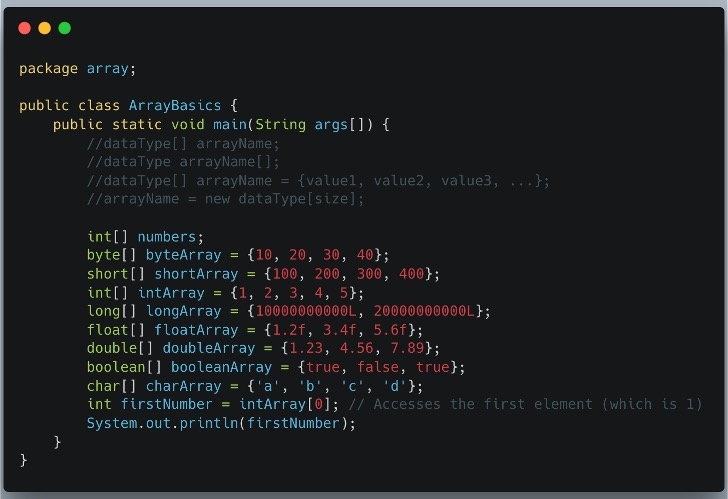

### Core Characteristics of Java Arrays

* **Homogeneous Data**
Arrays can only store elements of a **single, consistent type**. This includes:
* **Primitive types:** `int`, `char`, `boolean`, etc.
* **Objects:** `String`, `Integer`, or user-defined classes.


* **Fixed Size**
The size of an array is determined when it is created (instantiated) and **cannot be changed** afterward.
> **Tip:** To use a dynamic, resizable collection, the `ArrayList` class is recommended.


* **Zero-Indexed**
The first element of an array is accessed using index `0`, the second at index `1`, and so on, up to `array.length - 1`.
* **Objects in Java**
Arrays are objects and implicitly inherit from `java.lang.Object`. Memory for arrays is dynamically allocated on the **heap segment**.

---

### Declaring Arrays in Java

In Java, arrays are **objects** with a fixed size. While there are several ways to define them, the process typically involves declaring the variable, allocating memory, and initializing the values.

#### 1. Declaration Only

This approach defines a variable of an array type but **does not** create the actual array object or allocate memory on the heap yet. At this stage, the variable is simply a reference that points to `null`.

**Syntax:**

```java
dataType[] arrayName;

```

**Example:**

```java
int[] numbers;

```

---

### Other Common Initialization Methods

| Method | Description | Example |
| --- | --- | --- |
| **Allocation** | Reserves memory for a specific number of elements. | `numbers = new int[5];` |
| **Inline Initialization** | Declares, allocates, and fills the array in one step. | `int[] numbers = {1, 2, 3};` |
| **Using `new` Keyword** | Explicitly creates the object with specific values. | `int[] numbers = new int[]{10, 20};` |

---

```java
package array;

public class ArrayBasics {
    public static void main(String args[]) {

        //dataType[] arrayName;
        //dataType arrayName[];
        //dataType[] arrayName = {value1, value2, value3, ...};
        //arrayName = new dataType[size];

        int[] numbers;
        byte[] byteArray = {10, 20, 30, 40};
        short[] shortArray = {100, 200, 300, 400};
        int[] intArray = {1, 2, 3, 4, 5};
        long[] longArray = {10000000000L, 20000000000L};
        float[] floatArray = {1.2f, 3.4f, 5.6f};
        double[] doubleArray = {1.23, 4.56, 7.89};
        boolean[] booleanArray = {true, false, true};
        char[] charArray = {'a', 'b', 'c', 'd'};

        int firstNumber = intArray[0]; // Accesses the first element (which is 1)
        System.out.println(firstNumber);
    }
}
```

---




### Java Array Initialization Examples

In Java, you can initialize arrays for any primitive data type. The code demonstrates the use of **Array Initializers**, where values are provided inside curly braces `{}` at the time of declaration.

#### 1. Numeric Primitives

| Type | Example Initialization | Key Detail |
| --- | --- | --- |
| **byte** | `byte[] byteArray = {10, 20, 30, 40};` | Smallest integer type. |
| **short** | `short[] shortArray = {100, 200, 300, 400};` | 16-bit integer. |
| **int** | `int[] intArray = {1, 2, 3, 4, 5};` | The most common integer type. |
| **long** | `long[] longArray = {10000000000L, 20000000000L};` | Requires `L` suffix for literals. |

#### 2. Floating-Point and Logical Primitives

* **float**: `float[] floatArray = {1.2f, 3.4f, 5.6f};` (Requires `f` suffix).
* **double**: `double[] doubleArray = {1.23, 4.56, 7.89};` (Default decimal type).
* **boolean**: `boolean[] booleanArray = {true, false, true};` (Stores logical values).
* **char**: `char[] charArray = {'a', 'b', 'c', 'd'};` (Stores single characters in single quotes).

---

### Accessing Elements

As noted in your earlier points, Java arrays are **zero-indexed**. You access specific elements using the square bracket notation:

```java
// Accesses the first element (index 0), which is 1
int firstNumber = intArray[0]; 
System.out.println(firstNumber);

```

### Alternative Syntax (Declarations)

The code comments highlight that Java supports multiple declaration styles:

* `dataType[] arrayName;` (Preferred/Standard style)
* `dataType arrayName[];` (C-style, also valid in Java)

---

### Java Primitive Data Types Overview

In Java, every variable has a data type which determines the size and layout of its memory. Below is a breakdown of the eight primitive types supported by the Java language:

| Datatype | Description | Size | Range | Default Value |
| --- | --- | --- | --- | --- |
| **Byte** | 8-bit signed integer | 1 byte | -128 to 127 | `0` |
| **Short** | 16-bit signed integer | 2 bytes | -32,768 to 32,767 | `0` |
| **Int** | 32-bit signed integer | 4 bytes | -2,147,483,648 to 2,147,483,647 | `0` |
| **Long** | 64-bit signed integer | 8 bytes | -9,223,372,036,854,775,808 to 9,223,372,036,854,775,807 | `0L` |
| **Float** | 32-bit single-precision floating-point | 4 bytes | ~6 to 7 decimal digits of precision | `0.0f` |
| **Double** | 64-bit double-precision floating-point | 8 bytes | ~15 to 16 decimal digits of precision | `0.0d` |
| **Boolean** | Logical values | JVM dependent | `true` or `false` | `false` |
| **Char** | Single 16-bit Unicode character | 2 bytes | `\u0000` to `\uffff` (0 to 65,535) | `\u0000` |

---

### Advanced Array Declaration and Initialization

Beyond basic declaration, Java provides several ways to allocate memory and assign values to arrays.

#### 1. Declaration and Memory Allocation

This method reserves a specific amount of space on the heap using the `new` keyword. At this stage, elements are automatically assigned **default values** (e.g., `0` for `int`, `null` for objects, or `false` for `boolean`).

* **Syntax:** `dataType[] arrayName = new dataType[size];`

#### 2. Using Array Literals (Shortcut Syntax)

This is the most concise approach when values are known beforehand. The array size is implicitly determined by the number of elements provided within the curly braces `{}`.

* **Example:** `int[] numbers = {1, 2, 3};`

#### 3. Using `new` with an Array Literal

This explicit syntax is required if you declare the variable first and initialize it later, or when passing an array as an anonymous argument to a method.

* **Example:** `numbers = new int[]{10, 20, 30};`

---

### Multidimensional Arrays

Two-dimensional arrays follow similar patterns but use multiple sets of square brackets `[][]` to represent rows and columns.

| Method | Syntax / Example |
| --- | --- |
| **Initialization at Declaration** | `int[][] matrix = { {1, 2}, {3, 4} };` |
| **Using `new` Keyword** | `int[][] matrix = new int[3][3];` |

---

### Access and Iteration

* **Indexing:** Elements are accessed or modified using their index within square brackets (e.g., `array[0]`).
* **Safety:** Accessing a negative index or an index  `array.length` results in an **`ArrayIndexOutOfBoundsException`** at runtime.

#### Processing Arrays with Loops

* **Standard `for` loop:** Used when you need precise index control.
* **Enhanced `for-each` loop:** Used for simpler, more readable iteration over values when the index is not required.

---

### The `Arrays` Utility Class

Java includes the `java.util.Arrays` class, which provides powerful static methods for array manipulation:

* **`sort()`**: Orders the elements.
* **`fill()`**: Assigns a specific value to all elements.
* **`toString()`**: Converts the array into a readable string format for easy printing.

---

### Core Array Operations

Managing and manipulating elements in Java involves several fundamental steps:

* **Declaration:** This creates a reference variable capable of pointing to an array object. The preferred style is `int[] numbers;`.
* **Initialization (Allocation):** Memory is allocated on the heap using the `new` keyword, which fixes the array's size.
* Elements are automatically set to **default values** (e.g., `0` for `int`, `null` for objects).
* You can combine declaration and initialization using an array literal: `int[] age = {12, 4, 5, 2, 5};`.


* **Accessing Elements:** Uses a **zero-based index** within square brackets. For example, `age[0]` accesses the first element.
* **Updating Elements:** Change a value by assigning it to a specific index, such as `age[0] = 20;`.
* **Length Property:** Use `.length` to determine how many elements an array can hold.

---

### Traversal Methods

Iterating through elements is typically done using one of two loop types:

1. **Standard `for` loop:** Best for index-based control.
```java
for (int i = 0; i < age.length; i++) {
    System.out.println(age[i]);
}

```


2. **Enhanced `for-each` loop:** A simpler syntax for visiting every value.
```java
for (int value : age) {
    System.out.println(value);
}

```

---

### Utility Operations with `java.util.Arrays`

The `java.util.Arrays` class provides static methods to simplify common tasks:

| Operation | Method Example | Description |
| --- | --- | --- |
| **Sorting** | `Arrays.sort(age);` | Arranges elements in ascending order. |
| **Searching** | `Arrays.binarySearch(age, 5);` | Efficiently finds a value's index in a **sorted** array. |
| **Copying** | `Arrays.copyOf(age, length);` | Creates a new array with the same elements. |
| **Filling** | `Arrays.fill(newAge, 10);` | Assigns a specific value to every element. |
| **String Conversion** | `Arrays.toString(age);` | Returns a readable string like `[2, 4, 5, 5, 12]`. |

> **Pro Tip:** You can also use `age.clone();` to create a shallow copy of an existing array.

---

In competitive programming, Java arrays are a cornerstone for building high-performance solutions. Their contiguous memory allocation allows for constant-time  random access, making them faster and more memory-efficient than many dynamic alternatives.

---

### Key Characteristics for Contests

* **Speed and Efficiency:** Arrays provide  time complexity for accessing and modifying elements by index, which is vital for meeting strict time limits.
* **Contiguous Memory:** Primitive arrays (e.g., `int[]`, `long[]`) store values directly in sequence, making them "cache-friendly".
* **Fixed Size:** Because arrays cannot be resized after creation, resizing requires a new allocation and an  copy operation.
* **Object Arrays:** Unlike primitives, arrays of objects store only the references contiguously, while the objects themselves reside elsewhere on the heap.

---

### Essential Competitive Programming Techniques

| Technique | Description |
| --- | --- |
| **Frequency Counting** | Using an element's value as an index in a "count array" to track occurrences. |
| **Prefix Sums** | Pre-computing sums of subarrays to answer range-sum queries in  time. |
| **Sliding Window** | Iterating through subarrays efficiently using indexed access. |
| **Matrix Operations** | Utilizing 2D arrays for grids, dynamic programming tables, or adjacency matrices. |

---

### Sorting and Performance Pitfalls

One critical detail in Java is how `Arrays.sort()` behaves differently based on the data type:

* **Primitive Arrays:** Uses a variation of **Quicksort**. While generally fast, it has a worst-case time complexity of , which can lead to a **Time Limit Exceeded (TLE)** error if a judge provides an "anti-quicksort" test case.
* **Object Arrays:** Uses a stable **Mergesort** (specifically TimSort). This guarantees a worst-case runtime of .
* **Mitigation Strategy:** To avoid the  trap, you can use object wrappers (e.g., `Long[]` instead of `long[]`) to force the use of the guaranteed  sort.

### Efficient Input Processing

For high-volume input, competitive programmers often move beyond the standard `Scanner`. Using `BufferedReader` or Java 8 streams allows for much faster parsing of large datasets into arrays.

---

To wrap up our discussion on Java arrays, here is a summary of common operations and their performance impacts, which is essential for both technical interviews and competitive programming.

### Complexity Analysis of Common Array Operations

| Operation | Time Complexity (Average Case) | Notes |
| --- | --- | --- |
| **Access element by index** | O(1) | Very fast due to direct memory access. |
| **Search (Linear)** | O(n) | Simple traversal requires visiting each element in the worst case. |
| **Search (Binary)** | O(logn) | Requires a sorted array; implemented via `Arrays.binarySearch()`. |
| **Insertion / Deletion** | O(n) | Elements must be shifted to accommodate changes because size is fixed. |
| **Sorting** | O(n logn) | `Arrays.sort()` is generally efficient, but be mindful of primitive worst-cases. |

---

### Key Takeaways for Mastery

* **Performance:** The constant-time  access makes arrays the preferred choice for performance-sensitive scenarios.
* **Memory Efficiency:** Primitive arrays store values directly in contiguous memory, which is cache-friendly and minimizes memory overhead.
* **Sorting Caution:** For primitive arrays, `Arrays.sort()` uses a Quicksort variation that can hit  in specific worst-case scenarios. Using object wrapper arrays (like `Integer[]`) ensures a stable  Mergesort.
* **Utility Usage:** Always leverage the `java.util.Arrays` class for standard tasks like `sort()`, `fill()`, and `binarySearch()` to reduce boilerplate code and potential bugs.

Understanding these performance trade-offs is a significant step toward succeeding in coding challenges.

---

The `java.util.Arrays` class is the primary utility for managing arrays in Java, offering highly optimized static methods that handle everything from sorting to stream conversion.

---

### Key Features of `java.util.Arrays`

* **Static Methods**: Methods are called directly on the class (e.g., `Arrays.sort(myArray)`) because the class cannot be instantiated.
* **Overloaded Support**: Most methods are overloaded to support all primitive types and object types.
* **Performance Optimization**: Uses specialized algorithms like **dual-pivot Quicksort** for primitives and **stable merge sort** for objects.

---

### Commonly Used Methods

| Method | Description |
| --- | --- |
| **`sort()`** | Sorts elements in ascending order; supports specific ranges and custom `Comparator` objects. |
| **`binarySearch()`** | Searches for a value in a **sorted** array; returns the index or a negative value if not found. |
| **`toString()`** | Returns a string representation like `[1, 2, 3]`, ideal for debugging. |
| **`equals()`** | Returns true if two arrays have the same length and matching elements. |
| **`deepEquals()`** | Used specifically for comparing content in **multi-dimensional arrays**. |
| **`fill()`** | Assigns a static value to all elements (or a specific range) of an array. |
| **`copyOf()`** | Creates a new array that is a copy of the original, with optional padding or truncation. |
| **`asList()`** | Converts an array to a fixed-size `List` backed by the original array; resizing is not allowed. |
| **`stream()`** | Returns a sequential `Stream` using the array as the source (Java 8+). |

---

### Insertion Operations and Limitations

Because Java arrays have a **fixed size**, they cannot dynamically grow to accommodate new data.

* **Capacity vs. Size**: **Capacity** is the total length of the array (`arr.length`), while **Size** refers to how many meaningful elements are actually stored.
* **Shifting**: Inserting an element at the beginning or middle requires shifting existing elements to the right to create space.
* **Resizing Strategy**: To "grow" an array, you must create a new, larger array and copy the existing data over.

---

# Array as List

How to perform Different operations in an array (in Static Memory)?

1. Insertion Operation
2. Deletion Operation
3. Display (Array Traversal)
4. Searching an element in Array.
---
## 1. Insertion Operation

### Creating ArrayAsList Class

```java
package array;

public class ArrayAsList {
	private int arr[];
	private int capacity;
	private int idx;
	
	.....
	.....
	.....
}

```
### Declaring Operations as methods in the ArrayAsList class

```java 
package array;

public class ArrayAsList {
	private int arr[];
	private int capacity;
	private int idx;
	
	//construction without parameter
	public ArrayAsList() {
		this.capacity = 5;
		this.idx = -1;
		this.arr = new int[this.capacity];
		System.out.println("Array Initialized!!!");
	}
	
	//constructor with capacity as parameter
	public ArrayAsList(int capacity) {
		this.capacity = capacity;
		this.idx = -1;
		this.arr = new int[this.capacity];
		System.out.println("Array Initialized!!!");
	}
	
	//constructor with capacity and an array
	public ArrayAsList(int capacity, int arr[]) {
		if(arr.length > capacity) {
			System.out.println("Array Length is more than the given Capacity");
			System.out.println("Array is not Initialized!!!");
		}
		else {
			this.capacity = capacity;
			this.idx = arr.length-1;
			this.arr = new int[this.capacity];
			for(int i = 0; i<arr.length; i++) {
				this.arr[i] = arr[i];
			}
			System.out.println("Array Initialized!!!");
		}
	}
	
	public int getCapacity() {
		return this.capacity;
	}
	
	public int getTotalElements() {
		return this.idx+1;
	}
	
	public boolean insertAtEnd(int x) {
		
	}
	
	public int deleteFromEnd() {
		
	}
	
	public boolean insertAtBegin(int x) {
		
	}
	
	public int deleteFromBegin() {
		
	}
	
}

```

### 1.1 Insert An Element At the End 
```java
package array;

public class ArrayAsList {
	private int arr[];
	private int capacity;
	private int idx;
		
	public boolean insertAtEnd(int x) {
		if(this.capacity != this.idx+1) {
			this.arr[++this.idx] = x;
			return true;
		}
		else
			return false;
	}
	
}

```
### 1.2 Insert An Element At the Beginning
```java
package array;

public class ArrayAsList {
	private int arr[];
	private int capacity;
	private int idx;
		
	public boolean insertAtEnd(int x) {
		if(this.capacity != this.idx+1) {
			this.arr[++this.idx] = x;
			return true;
		}
		else
			return false;
	}
		
	public boolean insertAtBegin(int x) {
		if(this.capacity != this.idx+1) {
			for(int i = this.idx; i>=0; i--) {
				this.arr[this.idx+1] = this.arr[this.idx];
			}
			this.arr[0] = x;
			
			return true;
		}
		else
			return false;
	}
	
}

```
### 1.2 Insert An Element At the Given Position


---
## 2. Deletion Operation
### 2.1 Delete An Element From the End 
### 2.2 Delete An Element From the Beginning
### 2.2 Delete An Element From the Given Position

---
## 3. Display (Two ways)
### 3.1 Display 
### 3.2 Display Reverse

---
## 4. Searching an element in Array

---
## Array Rotation


---
