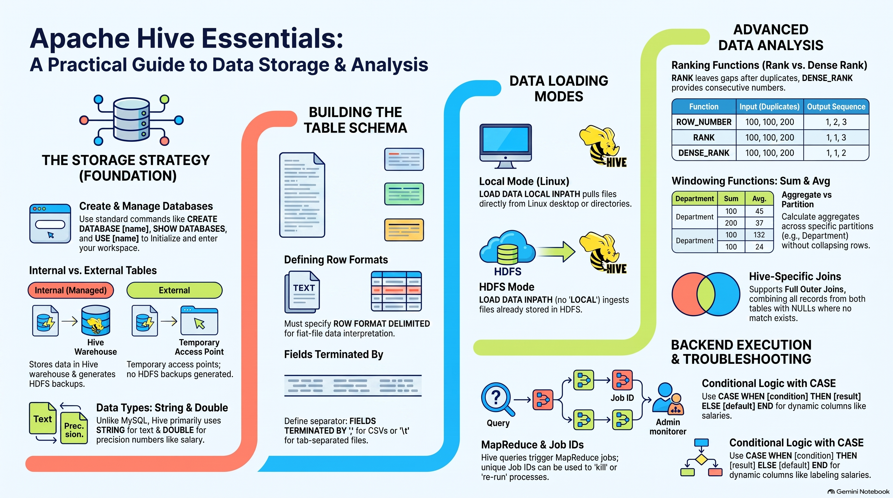

# Hive Practicles
### **1. Hive Database Management**
The data storage strategy in Hive follows a specific schema: first creating a database, then tables within it, and finally loading data into those tables.
*   **Create Database:** `CREATE DATABASE database_name;`.
*   **Check Databases:** `SHOW DATABASES;`.
*   **Switch Database:** Before performing operations on a specific database, you must use it with `USE database_name;`.
*   **Delete Database:** `DROP DATABASE database_name;`.

### **2. Internal (Managed) vs. External Tables**
Hive classifies tables into two primary types: **Internal (also called Managed)** and **External**.

#### **Internal Tables**
*   **Definition:** These are the standard tables where Hive manages the data lifecycle. 
*   **Syntax & Data Types:** `CREATE TABLE table_name (id INT, name STRING, salary DOUBLE);`. Note that Hive uses **`STRING`** for characters (similar to `VARCHAR` in MySQL) and **`DOUBLE`** for decimal values.
*   **Row & Field Formatting:** Because data is loaded from files, you must specify the format:
    *   `ROW FORMAT DELIMITED`: Indicates each new line is a new record.
    *   `FIELDS TERMINATED BY ','`: Used for comma-separated files. If data is tab-separated, use `'\t'`; if it uses a dollar sign, use `'$'`.
*   **Storage & Backup:** When an internal table is created, Hive automatically generates a **backup in HDFS** at the location: `/user/hive/warehouse/db_name/table_name`.

#### **External Tables**
*   **Definition:** Created using the **`EXTERNAL`** keyword, these are considered **temporary tables** that take temporary access to your existing data.
*   **Key Difference:** Unlike internal tables, external tables **do not generate a backup** in the warehouse directory.
*   **Location:** You must specify the HDFS directory path for the data using the `LOCATION` keyword.

### **3. Data Loading Modes**
There are two primary ways to load data into Hive tables:
*   **Local Mode (Linux/Desktop):** Used when the file is on the local Linux system.
    *   Command: `LOAD DATA LOCAL INPATH 'local_path' INTO TABLE table_name;`.
*   **HDFS Mode:** Used when the data is already in an HDFS directory.
    *   Command: `LOAD DATA INPATH 'hdfs_path' INTO TABLE table_name;`.

### **4. Data Analysis with HiveQL**
Hive supports nearly all standard SQL commands for data analysis.
*   **Basic Clauses:** `SELECT *`, `WHERE` (filtering), `DISTINCT` (unique records), `LIMIT` (top records), and `ORDER BY` (sorting).
*   **Joins:** Hive supports **Inner, Left Outer, Right Outer, and Full Outer Joins**. Notably, Full Outer Join works in Hive even if it is not supported in some traditional SQL versions. It also supports **Cross Joins** (multiplication of records) and **Self Joins** (joining a table with itself).
*   **Case Statements:** Used for conditional logic (similar to `IF-ELSE`). For example, you can create a new column that labels a salary as "High" if it is greater than 60,000, or "Low" otherwise.

### **5. Window Functions**
Window functions allow for advanced ranking and aggregation without collapsing rows.
*   **ROW_NUMBER():** Assigns a unique, sequential number to every record (1, 2, 3...).
*   **RANK():** Assigns the same number to duplicate records but **skips the next number** in the sequence (e.g., 1, 1, 1, 4).
*   **DENSE_RANK():** Assigns the same number to duplicates but keeps the sequence **consecutive** (e.g., 1, 1, 1, 2).
*   **Aggregations:** Includes `SUM`, `AVERAGE`, `MAX`, and `MIN`. For example, `SUM` can be used to calculate a running total or group-level total for salaries.

### **6. Operational Internals**
*   **Execution Backend:** For complex operations like `ORDER BY` or `JOIN`, Hive triggers a **MapReduce job** in the background.
*   **Troubleshooting:** Every analytical task generates a **Job ID**. If a job gets stuck (e.g., taking hours instead of minutes), this ID is shared with the **Admin team**, who may "kill" the job and ask for a rerun after checking cluster health.
*   **Initialization:** To start Hive, ensure all Hadoop services are running (`jps`) and then simply type `hive` in the terminal. All commands in the shell should end with a semicolon (`;`).

