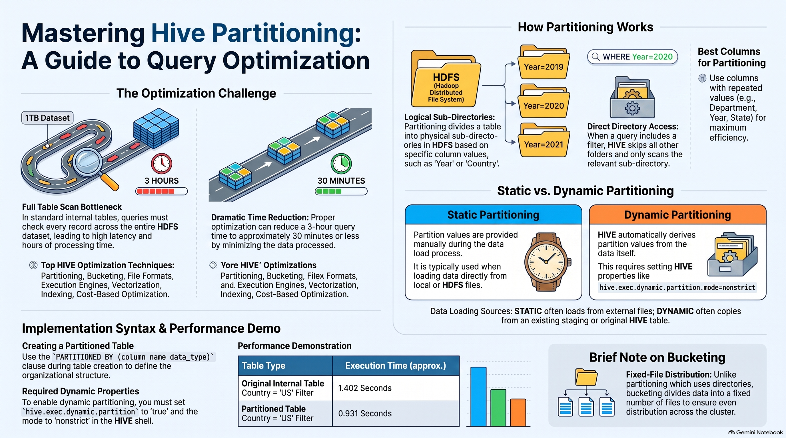

# Advanced Hive (Partitioning & Bucketing)
### **1. Advanced Hive: Optimization Overview**
Optimization techniques are essential in "Advanced Hive" to handle massive datasets (e.g., 1 Terabyte or more). The primary goal is to **reduce query execution time** and **improve system performance**. While a standard query might take 3 hours on a massive table, optimization can reduce that time to 15–30 minutes.

**Common Optimization Techniques:**
*   **Partitioning** (Most important)
*   Bucketing
*   Use of specific File Formats
*   Execution Engine installation
*   Vectorization and Indexing
*   Cost-Based Optimization (CBO)

---

### **2. Hive Partitioning**
**Definition:** Partitioning divides a large table into **subdirectories** based on the values of a specific column.

#### **How it Works (Internal Logic):**
*   **Simple Table:** When a query is run (e.g., `WHERE year = 2020`), Hive performs a **row-by-row analysis**, scanning every single record in the 1TB file to check for matches. If there are billions of records, this takes hours.
*   **Partitioned Table:** Hive creates separate physical subdirectories in HDFS for each unique value in the partition column (e.g., `year=2020/`, `year=2021/`). When the query runs, it **skips all other data** and goes directly to the specific subdirectory, drastically reducing the amount of data scanned.

#### **Best Use Cases:**
*   Partitioning is most effective on columns with **highly repeated records**, such as **Year, Department, or Country**.
*   It is not recommended for columns with unique values (like ID or Name), as it would create too many small subdirectories, offering no performance benefit.

---

### **3. Types of Partitioning**

| Feature | **Static Partitioning** | **Dynamic Partitioning** |
| :--- | :--- | :--- |
| **Data Load** | Values are provided **manually** during the data load. | Values are derived **automatically** from the data. |
| **Source** | Typically loaded from a **local file** or HDFS file. | Loaded from an **existing Hive table**. |
| **Complexity** | Requires manual input for each partition value (e.g., `country='US'`). | Faster for large-scale data ingestion across multiple categories. |

---

### **4. Practical Implementation**

#### **Table Creation:**
The syntax is similar to internal tables but includes the `PARTITIONED BY` clause. Note that the partition column is **not** included in the main column list.
```sql
CREATE TABLE sales_partitioned (id INT, amount INT) 
PARTITIONED BY (country STRING)
ROW FORMAT DELIMITED FIELDS TERMINATED BY ',';
```

#### **Dynamic Partitioning Requirements:**
To use dynamic partitioning, you must set specific Hive properties to "true" and "nonstrict" mode:
*   `set hive.exec.dynamic.partition = true;`
*   `set hive.exec.dynamic.partition.mode = nonstrict;`

#### **Loading Data:**
*   **Static:** `LOAD DATA LOCAL INPATH '/path/file' INTO TABLE table PARTITION (country='US');`
*   **Dynamic:** `INSERT INTO TABLE table PARTITION (country) SELECT id, amount, country FROM original_table;`

---

### **5. Bucketing**
**Definition:** Bucketing divides data into a **fixed number of files** (buckets) rather than subdirectories.
*   **Logic:** It does not necessarily look for specific column values to create directories; instead, it uses a hash function to **evenly distribute** data across the specified number of buckets.
*   **Use Case:** If you specify four buckets, Hive will ensure the data is distributed equally into four files.

---

### **6. Summary of Benefits**
In practical demonstrations, a query that took **1.402 seconds** on a standard internal table was reduced to **0.931 seconds** on a partitioned table, even with a small dataset. On production-level data (Terabytes), this difference becomes massive, allowing for the 10–20 minute response times expected by clients.

