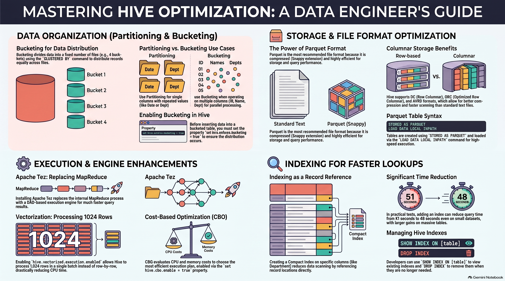

# Hive Optimization techniques (improve query performance, optimize data scanning, and reduce execution time for massive datasets)

### **1. Bucketing in Hive**
Bucketing is used to divide data into a fixed number of files to enhance parallel processing.

*   **Mechanism:** When creating a table, you specify the number of buckets (e.g., `INTO 4 BUCKETS`) and the column to cluster by (e.g., `CLUSTERED BY (emp_id)`). 
*   **Data Distribution:** Records are equally distributed across the specified number of files. For example, 10 million records would be distributed into four buckets of 2.5 million records each.
*   **Internal Sorting:** By using `CLUSTERED BY`, the data within each bucket is automatically sorted in ascending order based on the chosen column.
*   **Sampling:** You can query a specific bucket rather than the entire table using the `TABLESAMPLE` clause (e.g., `TABLESAMPLE(BUCKET 1 ON emp_id)`).
*   **Bucketing vs. Partitioning:**
    *   **Partitioning** is best for columns with highly repeated records (like Year or Department) where you target a specific subdirectory.
    *   **Bucketing** is preferred when performing operations across **multiple columns** (ID, Name, and Department) because the query can process the buckets in parallel.

### **2. File Format Optimization**
Using efficient file formats significantly improves storage efficiency and query speed.

*   **Supported Formats:** Hive supports Text files, RC (Row Columnar), ORC (Optimized Row Columnar), Avro, and **Parquet**.
*   **Best Practice:** **Parquet** is currently considered the best-performing file format.
*   **Implementation:** You define the format during table creation using the `STORED AS PARQUET` clause.
*   **Features:** Parquet files often use the `.snappy` extension for compression. Because they are compressed and highly structured, they reduce query time and save storage space.

### **3. Execution Engine Optimization (Apache Tez)**
The execution engine is the backend that processes Hive queries.

*   **Apache Tez:** Replacing the traditional MapReduce engine with Apache Tez significantly speeds up queries.
*   **How it Works:** Tez supports **DAG (Directed Acyclic Graph)** based execution, which is more efficient than the step-by-step MapReduce process.
*   **Role:** While typically installed by the Admin team, developers benefit from the faster execution of their HiveQL.

### **4. Vectorization**
Vectorization is a powerful setting that changes how Hive processes rows.

*   **Standard Processing:** Normally, Hive processes records line-by-line, checking filters and conditions for each individual row.
*   **Vectorized Processing:** By enabling vectorization, Hive processes **1,024 rows at a time** in a single batch.
*   **Activation:** Set the property `set hive.vectorized.execution.enabled = true;`.
*   **Impact:** This can drastically reduce query time from hours to minutes for very large tables.

### **5. Indexing in Hive**
Indexing creates a reference to records to avoid scanning the entire table during a query.

*   **Purpose:** Much like a book index, it points the engine directly to the relevant data, reducing unnecessary scanning time.
*   **Syntax:** `CREATE INDEX [index_name] ON TABLE [table_name] ([column]) AS 'COMPACT' WITH DEFERRED REBUILD;`.
*   **Management:**
    *   **Show:** `SHOW INDEX ON [table_name];`.
    *   **Drop:** `DROP INDEX [index_name] ON [table_name];`.

### **6. Cost-Based Optimization (CBO)**
CBO is an internal optimization technique that plans the most efficient way to run a query.

*   **Logic:** Instead of following simple rules, CBO evaluates the **cost of CPU, memory, and I/O usage** based on data statistics to decide the order of joins and filters.
*   **Activation:** Set the property `set hive.cbo.enable = true;`.

### **7. Combined Optimization Strategy**
In a production environment, Data Engineers often combine these techniques for maximum efficiency.

*   **Hybrid Approach:** You can create a table that is **both partitioned and bucketed**.
*   **Example Structure:** A table partitioned by `country` (creating directories) and then bucketed by `ID` (creating four files inside each directory) ensures the data is both logically organized and physically optimized for parallel processing.

