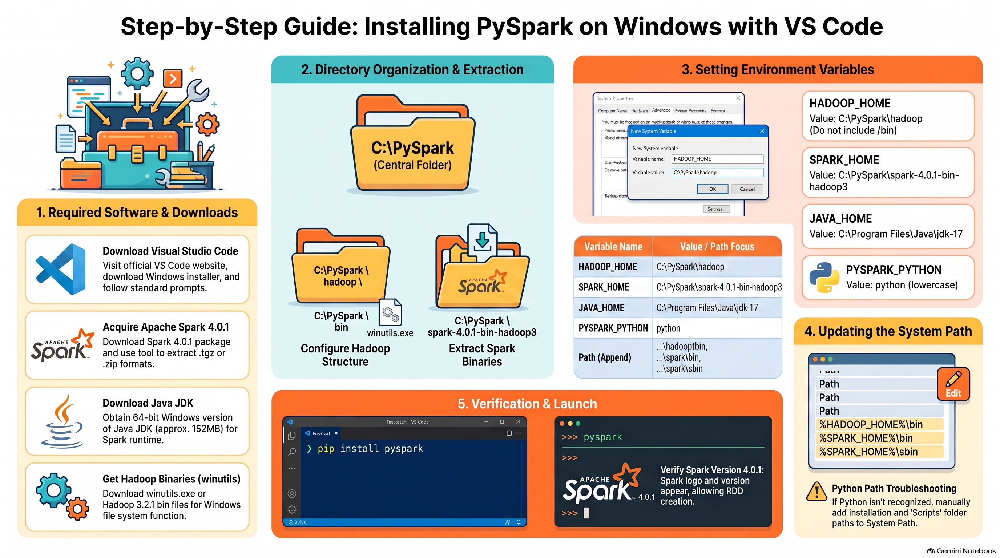

# Big Data development environment on Windows (installing PySpark using Visual Studio Code (VS Code)) 

### **1. Essential Software Prerequisites**
To successfully run PySpark on Windows, you must download and install the following components:
*   **Visual Studio Code (VS Code):** The primary code editor; download the Windows version and follow the standard "next-next" installation steps.
*   **Apache Spark:** The session specifically mentions version **4.0.1**.
*   **Java Development Kit (JDK):** Required to run Spark; the video demonstrates using **Java 8 (JDK 8)**.
*   **Hadoop Binaries:** Specifically the `winutils.exe` or equivalent application files for Hadoop (version **3.2.2** is referenced) to allow Spark to function on Windows.
*   **Python:** Required for PySpark; version **3.11** is recommended, as older versions like 3.3 may not support modern libraries.

### **2. Directory and Folder Management**
Proper folder structure is critical for setting environment paths correctly:
*   **Base Folder:** Create a central folder (e.g., named "pyspark") on your **C: Drive** to prevent accidental deletion, which often happens with files on the Desktop.
*   **Hadoop Structure:** Inside your base folder, create a folder named `hadoop` (lowercase), and inside that, create a `bin` folder. Place the downloaded Hadoop `.exe` file into this `bin` folder.
*   **Spark Extraction:** Extract the Spark `.tar` file into your base folder. Ensure that the extracted folder directly contains subfolders like `bin`, `conf`, and `data`.

### **3. Configuring Environment Variables**
You must register the software paths in the system's **Environment Variables** (search for "Edit the system environment variables" in Windows).

#### **A. System Variables (New)**
Create the following "Home" variables pointing to the **root** folder of each installation (not the bin folder):
*   **`HADOOP_HOME`:** Path to your `hadoop` folder.
*   **`PYSPARK_HOME`:** Path to your extracted `spark` folder.
*   **`JAVA_HOME`:** Path to your Java installation (e.g., `C:\Program Files\Java\jdk1.8.0`).
*   **`PYSPARK_PYTHON`:** Set the variable value simply to **`python`** (lowercase).

#### **B. Path Variable (Update)**
Double-click the existing **"Path"** variable and add the following entries pointing to specific execution folders:
*   **Hadoop Bin:** `.../hadoop/bin`.
*   **Spark Bin:** `.../spark/bin`.
*   **Spark SBin:** `.../spark/sbin`.

### **4. Final Installation and Verification**
Once the paths are set, use the terminal (CMD or VS Code Terminal) to finalize the setup:
1.  **Install PySpark Library:** Run the command `pip install pyspark`.
2.  **Verify Java:** Run `java -version` to ensure Java is active.
3.  **Launch PySpark:** Type `pyspark` in the terminal. If successful, you will see the Spark version (4.0.1) and a command prompt for running Spark code.
4.  **Testing:** You can now create **RDDs (Resilient Distributed Datasets)** and **DataFrames** within VS Code.

### **5. Troubleshooting Tips**
*   **Python Path Issues:** If the `pyspark` command is not recognized, you may need to manually add the Python installation path and its **Scripts** folder to your Environment Variables.
*   **Hidden Folders:** The Python path is often located in the `AppData` folder, which is hidden by default. You must enable **"Show hidden files, folders, and drives"** in Windows File Explorer to find it.
*   **Path Precision:** If you have nested folders (e.g., a Spark folder inside another Spark folder), the `PYSPARK_HOME` must point to the folder that immediately contains the `bin` and `conf` directories.

