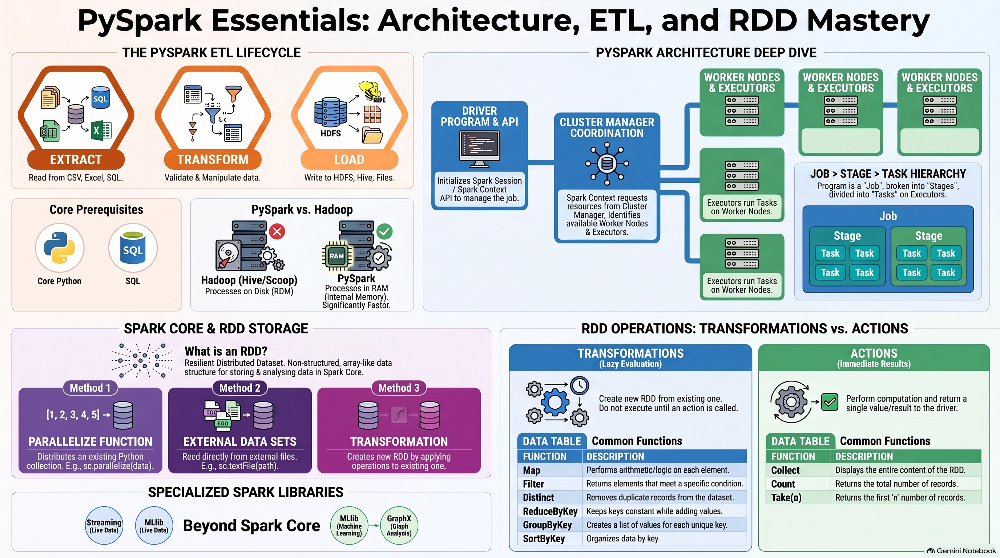

# PySpark Architecture, the ETL process, and Spark Core fundamentals

### **1. Introduction to PySpark and ETL**
PySpark is a tool used to process Big Data by following the **ETL (Extract, Transform, Load)** process. To work with PySpark, a foundational knowledge of **Core Python and SQL** is required.

*   **Extract:** This involves reading data from various sources such as CSV files, Excel files, or MySQL databases.
*   **Transform:** Data is validated (checking for null values or proper formats) and manipulated using SQL queries or PySpark functions (e.g., filtering records or applying logic).
*   **Load:** The final processed data is written or "loaded" into a destination, such as a CSV file, an Excel sheet, or a Hive table.

### **2. PySpark Architecture**
PySpark's architecture is designed for distributed processing and consists of several key components working together.

#### **A. Driver Program and APIs**
The **Driver Program** is where the actual programming and logic reside. Before any programming can begin, an API—specifically **SparkContext or SparkSession**—must be defined. This API acts as the entry point and treats the program as a "job" to be executed.

#### **B. Jobs, Stages, and Tasks**
*   **Job:** When a program runs, the SparkContext creates a **Job ID**.
*   **Stages:** The job is divided into multiple **Stages** based on the data size and the specific commands used.
*   **Tasks:** Each stage is further broken down into **Tasks**, which represent individual commands (e.g., a `SELECT` statement with a `WHERE` clause).

#### **C. Executors and Cluster Manager**
*   **Cluster Manager:** The SparkContext requests the **Cluster Manager** for available resources. The manager identifies which **Worker Nodes** and **Executors** are free to handle the work.
*   **Executors:** These are responsible for the physical execution of tasks (similar to DataNodes in HDFS). Once the tasks are completed, the executors return the solution or write the data to the specified output variable.

### **3. Comparison: PySpark vs. Hadoop**
A major advantage of PySpark is that it is **independent of Hadoop**; it does not require Hadoop services (like NameNode or DataNode) to be active to function.

| Feature | Hadoop | PySpark |
| :--- | :--- | :--- |
| **Speed** | Slower (works on **ROM/Hard Disk**). | Faster (works on **RAM/Internal Memory**). |
| **Languages** | Primarily Java. | Supports Python, Scala, Java, and R. |
| **Tooling** | Needs separate tools (Sqoop for migration, Hive for SQL). | All-in-one (can read, analyze, and store data in one tool). |
| **Processing** | Mainly batch processing of historical data. | Supports real-time analysis (Streaming). |

### **4. Five Sections of PySpark**
PySpark is divided into five main technical areas, with the first two being the most critical for data analysis:
1.  **Spark Core:** Focusing on RDDs (Resilient Distributed Datasets).
2.  **Spark SQL:** Working with structured data/SQL queries.
3.  **Spark Streaming:** For fetching and analyzing live data.
4.  **Spark MLlib:** A machine learning library for running algorithms.
5.  **Spark GraphX:** For analyzing graph-based data (vertices and edges).

### **5. Spark Core: Understanding RDDs**
**RDD (Resilient Distributed Dataset)** is the fundamental data structure in Spark Core, storing data in an **array/list format** without headers or a fixed structure.

#### **A. Storing Data in RDDs (3 Ways)**
1.  **`parallelize()` Function:** Converts an existing Python list into an RDD.
2.  **External Datasets:** Reading data from text files, CSVs, or Excel files using `sc.textFile()`.
3.  **Transformations:** Creating a new RDD by performing operations on an existing one.

#### **B. RDD Operations**
Operations on RDDs are categorized into **Transformations** and **Actions**.
*   **Transformations:** These create a *new* RDD from an existing one. Examples include:
    *   **`map()`**: Performs arithmetic operations on each element.
    *   **`filter()`**: Filters records based on a condition (e.g., finding even numbers).
    *   **`flatMap()`**: Operates on fields rather than elements, often used for splitting strings into separate words.
    *   **`distinct()`**: Identifies unique records and removes duplicates.
    *   **`union()` / `intersection()`**: Standard set operations between two RDDs.
    *   **`reduceByKey()`**: Keeps keys constant while performing additions on their values.
*   **Actions:** These return a **single value** or a result. Examples include:
    *   **`collect()`**: Displays the entire data in the RDD.
    *   **`count()`**: Returns the total number of records.
    *   **`max()` / `min()`**: Returns the highest or lowest value.
    *   **`first()` / `take(n)`**: Returns the first element or the first *n* elements.

