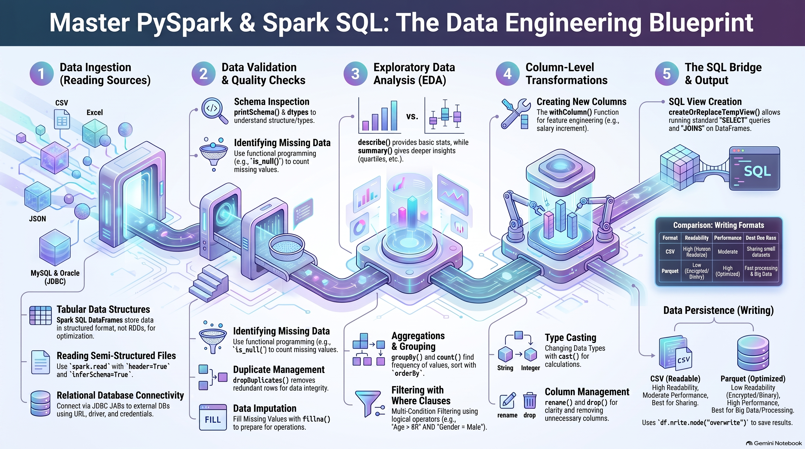

# Spark SQL
### **1. Core Concepts and Data Structures**
*   **DataFrame:** The primary data structure in Spark SQL. It is a **tabular, dimensional structure** where data is stored in a structured format, similar to Pandas.
*   **SparkSession API:** To use Spark SQL, you must first initialize the **SparkSession** API. This variable (often named `spark`) allows you to call all Spark SQL commands.

### **2. Extracting Data (Reading Sources)**
Spark SQL can read data from a wide variety of formats into DataFrames:
*   **CSV Files:** Use `spark.read.csv(path, header=True, inferSchema=True)`. The `inferSchema` option ensures headers are used for analysis and the data starts from the second line.
*   **Delimited Files:** For non-standard separators (like `$` or tabs), use `.option("delimiter", ",")` before reading.
*   **Excel Files:** Requires importing external libraries (e.g., `com.crealytics.spark.excel`). You must configure the Spark Session to include these specific JAR files.
*   **JSON Files:** Use `spark.read.json(path)`. For nested or multi-line JSON structures, you must set `.option("multiLine", True)`.
*   **Text Files:** Read via `spark.read.text(path)`. Use `truncate=False` in the `.show()` command to see the full content without it being cut off.
*   **RDBMS (MySQL/Oracle):** Connects via **JDBC**. This requires specifying the URL, driver, table name, username, and password.

### **3. Basic Data Inspection and Validation**
Once data is loaded into a DataFrame (`df`), you can use several functions to inspect it:
*   **df.show():** Displays the data in a table format.
*   **df.printSchema():** Displays the columns and their associated data types.
*   **df.count():** Returns the total number of rows.
*   **df.columns:** Lists all column names.
*   **df.describe():** Provides a basic statistical summary (Mean, Median, Mode).
*   **df.summary():** Provides a detailed statistical summary, including Standard Deviation and Max values.
*   **Type Casting:** Use the `.cast()` function to convert one data type to another (e.g., Integer to String).

### **4. Data Quality Checks**
Data Quality checks are essential to ensure the accuracy of the analysis:
*   **Null Values:** Detected using the `is_null` function often within a loop to check all columns simultaneously.
*   **Distinct Values:** Found using `countDistinct` to see how many unique values exist per column.
*   **Duplicates:** You can check for duplicate rows using `groupBy` or remove them permanently using **`df.dropDuplicates()`**.
*   **Blank Values:** Use filters to find empty strings (`""`) that are not technically `null` but contain no data.
*   **Handling Nulls:** Use **`df.fillna()`** to replace null values with a specific constant.

### **5. Exploratory Data Analysis (EDA)**
*   **Filtering:** Use `.filter()` (equivalent to the SQL `WHERE` clause) to isolate specific records based on conditions (e.g., `age > 30`).
*   **Group By & Aggregation:** Used to find unique records and perform calculations like `count`, `avg`, `min`, and `max` per category.
*   **Sorting:** Use `.orderBy()` to sort results. To sort in descending order, use the `f.desc()` function from `pyspark.sql.functions`.
*   **Column Operations:**
    *   **withColumn:** Create a **new column** or update an existing one based on an operation (e.g., `salary * 0.1`).
    *   **withColumnRenamed:** Change the name of an existing column.
    *   **drop:** Remove a specific column from the DataFrame.

### **6. SQL Integration (Temporary Views)**
A powerful feature of Spark SQL is the ability to run standard SQL queries on DataFrames:
*   **createOrReplaceTempView:** Converts a DataFrame into a **virtual SQL table** (e.g., `df.createOrReplaceTempView("employees")`).
*   **spark.sql():** Allows you to run nearly any SQL command (Joins, Case Statements, Filters) directly on that virtual table. Note that while you can select and join data, you cannot "insert" or "load" new data into these temporary views.

### **7. Loading Data (Writing to Files)**
After processing (Transformation), the data is "loaded" or written to a destination:
*   **df.write.mode("overwrite"):** Ensures that if the file already exists at the destination, it is overwritten.
*   **Formats:** Data can be saved as **CSV** (readable) or **Parquet** (encrypted/compressed for faster processing).

