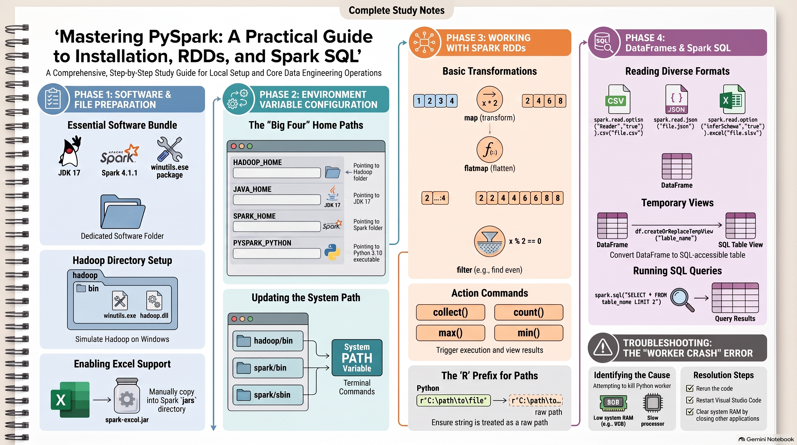

# PySpark on a Windows (installation, Spark Core (RDDs), and Spark SQL)

### **1. Installation and Environment Setup**
To run PySpark on Windows, several components must be downloaded and configured correctly to ensure the "Local" environment functions properly.

*   **Required Software:** You must download **Spark (Version 4.1.1 is used in the session)**, **JDK 17**, and the **winutils.exe** package.
*   **Directory Structure:** 
    *   Create a central software folder (e.g., `pyspark_software`). 
    *   Inside this, create a `hadoop` folder (lowercase), and within it, a `bin` folder containing `winutils.exe` and `hadoop.dll`.
    *   For **Excel support**, copy the `spark-excel` jar file into the `jars` folder located within the extracted Spark directory.
*   **Environment Variables:** You must set four critical "Home" variables and update the system Path:
    *   **`HADOOP_HOME`**: Path to the hadoop folder.
    *   **`JAVA_HOME`**: Path to the JDK 17 installation (usually in Program Files).
    *   **`SPARK_HOME`**: Path to the root of the extracted Spark folder.
    *   **`PYSPARK_PYTHON`**: The full path to the Python executable (Version **3.10** is recommended for best suitability).
*   **Path Updates:** Add the `bin` and `sbin` folders for Spark and the `bin` folder for Hadoop to the system **Path variable**.

### **2. Development Workflow in VS Code**
*   **File Management:** Open VS Code, create a Python file, and save it with a `.py` extension in a dedicated folder.
*   **Execution:** Right-click within the editor and select **"Run Python File in Terminal"** to execute the code.
*   **Path Handling:** When providing file paths for data reading, use the **`r` prefix** (e.g., `r"C:\path\file.txt"`) to treat the path as a raw string and avoid character errors.

### **3. Spark Core (RDD Operations)**
RDDs (Resilient Distributed Datasets) are used for low-level data manipulation. The session demonstrates various transformations and actions:

*   **Key Operations:** `parallelize`, `map`, `flatMap`, `filter`, `union`, `intersection`, `distinct`, `reduceByKey`, `groupByKey`, and `sortBy`.
*   **Map vs. FlatMap:** 
    *   **`map()`**: Processes each element individually (e.g., returning a list of words for each line).
    *   **`flatMap()`**: Processes elements and flattens the result into a single list of values.
*   **Actions:** Action commands like **`collect()`**, **`count()`**, **`max()`**, **`min()`**, and **`sum()`** are required to trigger execution and display results; without them, transformations are only planned, not executed.

### **4. Spark SQL and DataFrames**
Spark SQL allows for structured data analysis using DataFrames, which are tabular structures with headers.

*   **Creating DataFrames:** You can convert a Python list into a DataFrame and assign column names (e.g., ID, Name, Age).
*   **Reading File Formats:**
    *   **CSV:** Supports headers and automatic type detection via `inferSchema=True`. It can handle various delimiters like commas or tabs.
    *   **JSON:** Supports standard and multi-line JSON files (using the `multiLine` option).
    *   **Excel:** Requires a specific jar file and the format `com.crealytics.spark.excel`.
*   **SQL Integration:** 
    *   Use **`createOrReplaceTempView("table_name")`** to convert a DataFrame into a virtual SQL table.
    *   Once converted, you can run nearly any SQL query (e.g., `SELECT * FROM table LIMIT 2`) using `spark.sql()`. 
    *   **Note:** You can use SQL for analysis (joins, filters) but not for creating physical databases or inserting new data into these views.

### **5. Troubleshooting: Worker Crashes**
Running PySpark on local machines with limited resources (e.g., **8GB RAM**) often leads to errors such as "Worker Crash" or "Attempting to kill Python worker".

*   **Cause:** These errors occur when the processor is slow or the RAM is fully occupied by other applications, leaving no memory for the Spark worker to process tasks.
*   **Solutions:** 
    *   Rerun the code or restart the system/VS Code.
    *   Add specific configuration properties to the Spark setup to manage memory usage.
    *   Ensure non-essential applications are closed to free up RAM.

